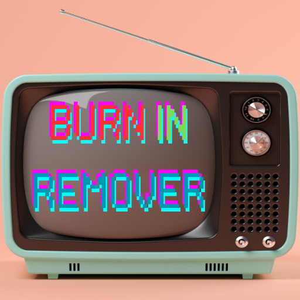

    

# SCREEN BURN IN REMOVER

## 概要

赤、緑、青、黒、白の色を代わる代わる表示させ、IPS や VA ディスプレイの焼付きを解消します。  
有機 EL の発光体の劣化による焼付きは治すことはできません。

## 使い方

[SCREEN BURN IN REMOVER](https://harusame0616.github.io/screen-burn-in-remover) にアクセスしてください。  
**※ 画面が点滅するのでご注意ください。**

ページを開くと自動的に色が変わりますので、全画面にしてしばらく放置してください。  
焼付きの程度によっては数十時間かかる場合もあります。
